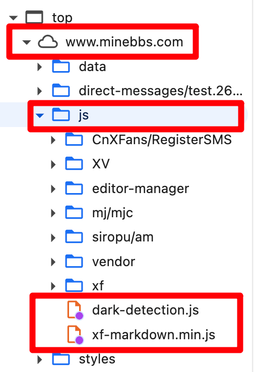

# 本地测试说明

为了测试脚本的运行情况，我们可能需要在实际的网页上运行测试。但是，频繁替换远端文件不仅繁琐，还可能因为 CDN 等因素造成延迟导致测试无法照常进行，不符合生产开发环境隔离，同时还有一定的安全问题。

这时，我们需要用到 Chrome 浏览器提供的脚本劫持功能，简单而言，它可以将网页加载的脚本替换为你的本地副本。通过劫持，我们可以直接让网页加载我们本地最新的脚本，而不需要更新远端文件；同时，由于劫持只发生在我们的计算机上，也不会影响到除了调试者外的任何人。

## 设置脚本劫持

按照以下步骤来设置脚本劫持。

1. 在你 clone 下来的项目目录中，新建一个文件夹，名称与你要劫持的那个网站的完整域名相同。例如，在 MineBBS 上进行测试时，该文件夹命名为 `www.minebbs.com`
2. 在该目录中，复刻出与我们想要测试的文件（脚本、样式表等）相关的网页实际目录结构
3. 将脚本命名为匹配的名称后，复制到相应的位置
4. 打开 Chrome 并访问要调试的网站，打开开发者工具并切换到“源代码/来源”选项卡下的“替换”选项卡。
5. 单击“选择放置替换项的文件夹”，选择项目目录（直接包含 `www.minebbs.com` 目录的那个目录）
6. 访问网站或刷新页面，此时若观察到“网页”选项卡中相应文件出现紫色小圆圈，就表明完成了劫持。此时脚本的行为完全被本地的版本接管，与线上的版本无关。

Note: 除了可以劫持脚本，还可以劫持样式表等文件。

## 借助 esbuild 自动构建，快速查看脚本运行效果

项目下面有一个脚本 watch.mjs，用于监听脚本的变化并编译脚本，如果编译成功，脚本会被自动复制到 `./www.minebbs.com/js/xenforo-markdown.min.js`。

在实际开发中，你可以一开始将目录结构创建好，之后每次改代码时都运行 `npm run watch` 来监听脚本变化，它会自动构建和复制脚本到上述位置。此时无需任何额外操作，只需刷新页面即可看到脚本最新的效果。

简单来说，此步大大提升了调试效率，使得可以专注于改代码→刷新页面→继续改代码的工作流程中。

## 教程：如何复刻目录结构

1. 打开 Chrome 浏览器，访问你要调试的那个网站，打开开发者工具（F12）
2. 切换到“源代码/来源”选项卡下的“网页”子选项卡
3. 观察此处的结构，形成目录结构

以 MineBBS 为例，从 top 下的一级开始作为第一层，依次访问到你想要替换的文件那一层（此处以替换 dark-detection.js 和 xenforo-markdown.min.js 为例）：

由此得出目录结构为 `www.minebbs.com/js`，后续我们要替换的文件需要命名为 `dark-detection.js` 和 `xenforo-markdown.min.js`，放置在 `js` 目录下面。

> [!IMPORTANT]
> 目录结构和文件名是固定的，不可改变。这由远端决定，我们所做的正是让本地结构**完全符合**远端的需求，进而完成劫持。